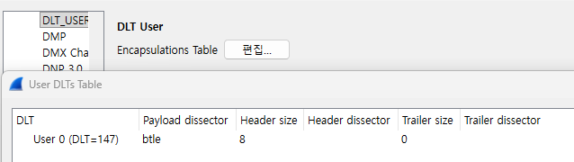
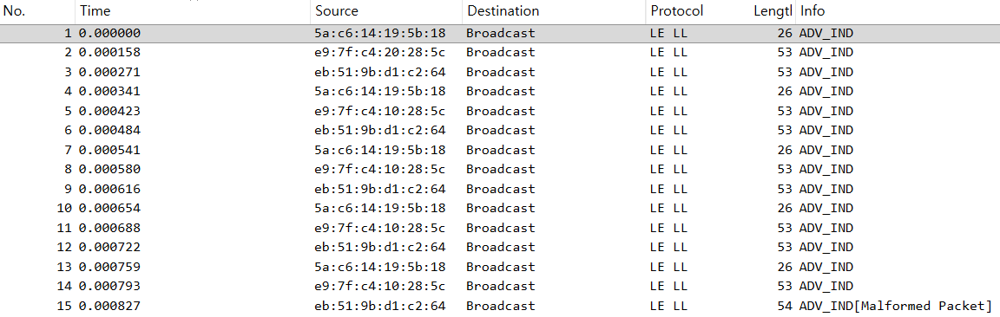

tibtle2pcap
===========

Convert TI SmartRF Bluetooth Low Energy Packet Captures to Libpcap Format (modified for `Python 3`)

Read a Bluetooth Low Energy packet capture savefile generated by
the TI Packet Sniffer utility (.psd file, but not PhotoShop), and convert it
to a libpcap packet capture file.  The libpcap packet capture file is formatted
to use the PPI DLT, with DLT_USER set so the BTLE Wireshark plugin can be used
to decode the BTLE traffic.

You can download the SmartRF Packet Sniffer software here:
   http://www.ti.com/tool/packet-sniffer

The CC2540 USB Evaluation Kit USB dongle that captures Bluetooth LE
traffic (and injects) with default firmware is available from digikey.com
and many other sites for $50 with the part number CC2540EMK-USB.

THANK

Joshua Wright


## USAGE

```
C:\>python tibtle2pcap.py fitbit-smartrf.psd out.pcap
```

The capture file "fitbit-smartrf.psd" is included with this software as an example.


## Wireshark Configuration Guide

This guide explains how to configure Wireshark to correctly parse `.pcap` files generated from a CC2540 sniffer (e.g., via the `tibtle2pcap` script).

### Configuration Steps

1.  In Wireshark, click `Edit` > `Preferences...`.
2.  In the 'Preferences' window, expand the `Protocols` section from the list on the left.
3.  Scroll down and select `DLT_USER` from the protocol list.
4.  On the right side, find the row for **`User 0 (DLT=147)`**.
5.  Set the values for this row exactly as follows:
    * **Payload dissector:** `btle`
    * **Header size:** `8`
    * **Header dissector:** (leave blank)
    * **Trailer size:** `0`
    * **Trailer dissector:** (leave blank)

    

6.  Click `OK` to save the settings.

Wireshark will now show the `LE LL` protocols.



### Any issue

<donggeun.kwon@gmail.com>